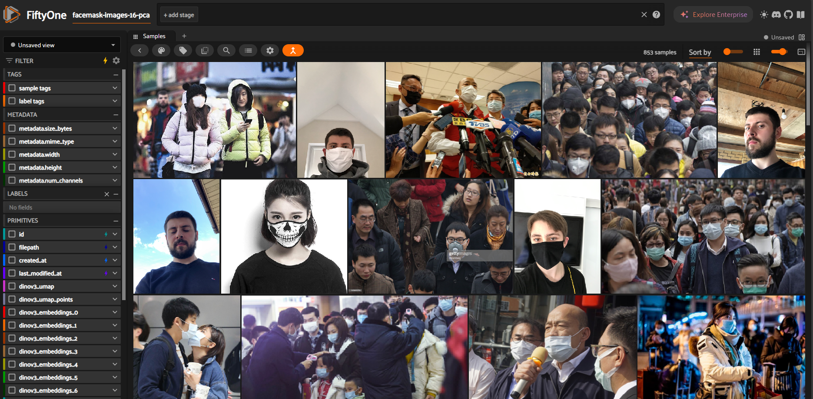
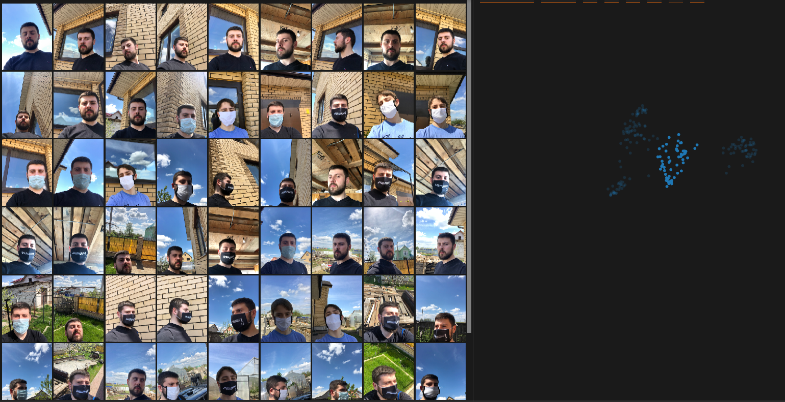
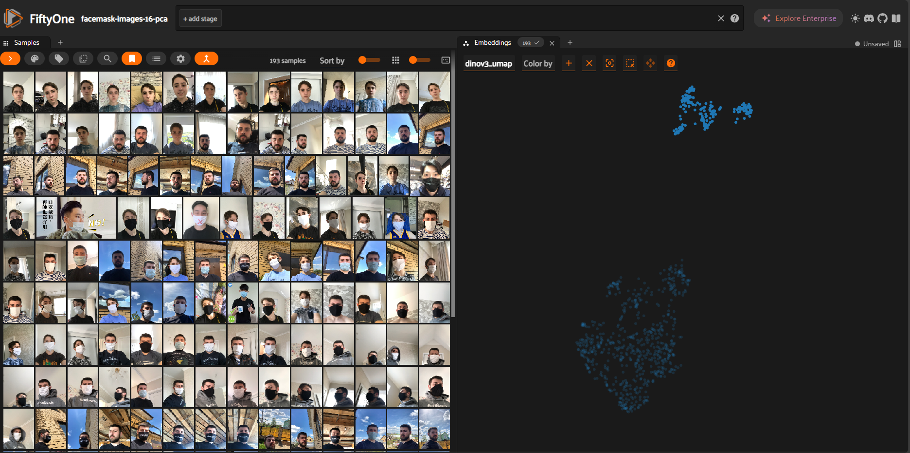
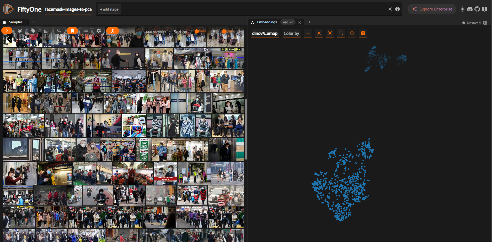
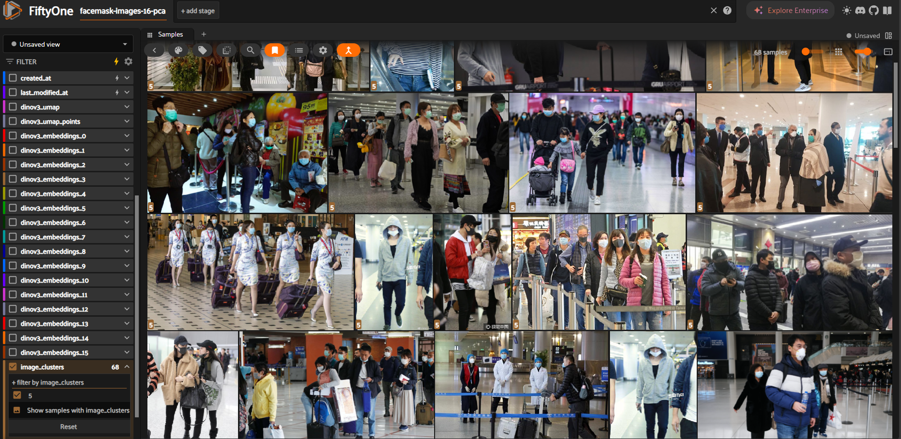
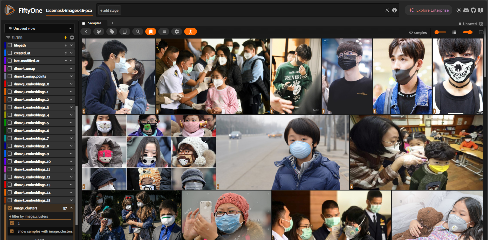

# Visual exploration using fiftyone

This is an incomplete exploration report. Fiftyone is a great tool to visualize and explore your data. Here i visualize the data using umap (like t-sne but different) to aid visualizing the images.

The goal is simple: to identify visual groups and find clusters that i can use to gauge the kind of variety i need to watch out for.

## Feature extraction

Everything done using the expressjs-onnxruntime-server and the first script. I dont think much else needs to be said, i just extract image features using DINOv3 and save it to an sqlite database.

## Visualizing the data

Before I visualize the data, i did a PCA to reduce the amount of dimensions before clustering. I think this is redundant for the visualization we're doing later on, but it's necessary so my PCA run doesn't take too long to complete.

I also separate each PCA dimension into a straight line to see what each dimension represents, just for fun.

After loading everything into the dataset, we just run the fiftyone UI and open it in the browser.

Since we already used UMAP to visualize our data, the coolest thing we can do is to look at the visualized point mapped to a 2d space and highlight each clusters to see what groups some images together. For instance, this cluster here seems to group together single person selfies with a sky as background. You can clearly see there are some groupings here. Of course the clusters wont be that accurate / segmented but it's great to see patterns and variabilities.

We can see there are two big groups. It seems like the upper cluster is filled with single-person close up images (with some exceptions)

And the other is filled with multiple-person pictures.

You get the idea. From this finding though, it feels like the 2-dimension visual cluster is not enough to capture the actual variability of the dataset. Next i tried clustering. FiftyOne provides the ability to perform clustering on image embeddings. Here, i chose all the default settings, except the cluster which i choose to be 16. No reason, just initial guess. 

Some clusters are meaningful, for example, this seems to cluster together images that have an airport / train station setting.

This cluster collects together a specific type of mask that has one of those air valves.

Some aren't as clear. I guess this is one of the "whatever" cluster the algorithm put together.

You get the idea. After looking around for a while, i decided against trying to find visual clusters this early. One reason is I know it's gonna be a problem especially with such a small dataset. We will end up with too much specific clusters that we will end up merging anyways, and it is a pain. Second reason, is that it's much meaningful to do this kind of analysis after we get an initial benchmark to identify the weakness of our trained model to plan out the next iteration.